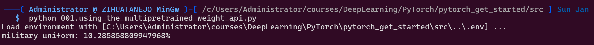

# pytorch-get-started
Get started with PyTorch

* Windows
* Python 3.11
* GPU

```
pip install -r requirements.txt
```

# Tutorials

## 001. How to Train State-Of-The-Art Models Using TorchVision’s Latest Primitives

https://pytorch.org/blog/how-to-train-state-of-the-art-models-using-torchvision-latest-primitives/

```
cd src
python 001.using_the_multipretrained_weight_api.py
```

